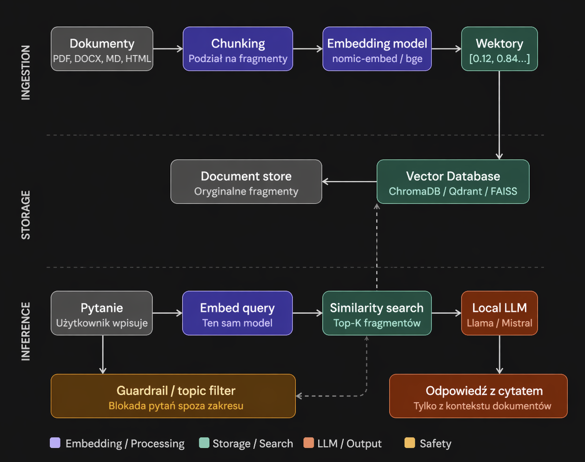
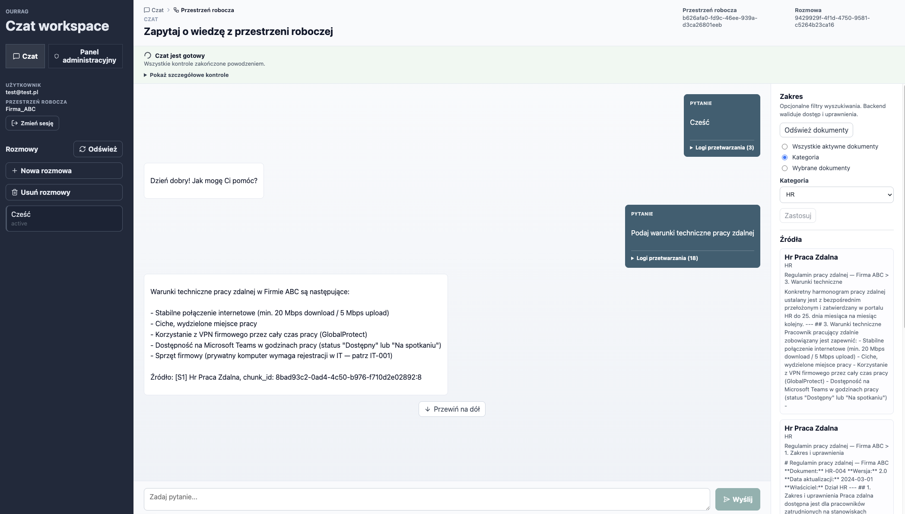
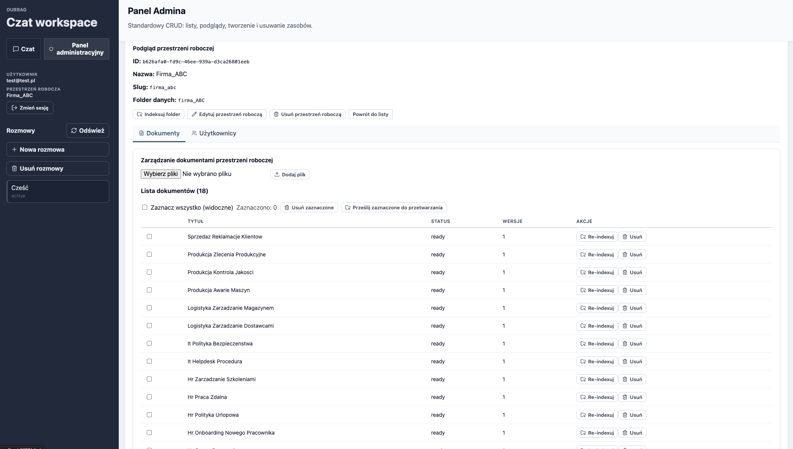

# ourRAG

`ourRAG` is a local-first document intelligence platform focused on internal company knowledge chat in Polish, built around Retrieval-Augmented Generation (RAG).

The current project target is local use only. The app keeps workspace scoping and retrieval safety, but it does not aim to provide production-grade authentication or hardened admin security.

## Product goals

The system is designed to:

- answer user questions using company-owned documents,
- keep conversations scoped to an explicitly selected workspace,
- support conversation memory so users can continue topics naturally,
- show sources used to build the answer,
- support document versioning and invalidation,
- run locally with Docker-managed services,
- start with Markdown (`.md`) ingestion and evolve toward PDF, TXT, and DOCX.

## MVP scope

The MVP includes:

- backend written in Python,
- frontend written in React,
- chat UI based on `assistant-ui`,
- PostgreSQL for relational data,
- Qdrant for vector search,
- Ollama running locally with Bielik as the generation model,
- local filesystem storage for uploaded files,
- workspace isolation using explicit workspace context,
- asynchronous ingestion and indexing,
- source attribution in responses,
- conversation memory using recent messages and rolling summaries.

## Solution concept and UI

### Solution concept



### Chat UI



### Admin UI



## Key product assumptions

- A single local application instance can serve many workspaces.
- A user may belong to many workspaces.
- A conversation belongs to exactly one workspace.
- The user must explicitly select the active workspace before chatting.
- Retrieval is always scoped to the active workspace.
- Documents are versioned.
- Only active document versions are used for standard answers.
- Older versions may be invalidated from the local admin surface.
- Hybrid search and reranking are planned extensions, not MVP features.
- English language support is a future extension; MVP is Polish-first.

## Recommended documentation reading order

1. `docs/ARCHITECTURE.md`
2. `docs/DOMAIN_MODEL.md`
3. `docs/DATA_MODEL.md`
4. `docs/INGESTION_PIPELINE.md`
5. `docs/RETRIEVAL.md`
6. `docs/CHAT_MEMORY.md`
7. `docs/API_CONTRACT.md`
8. `docs/CONFIGURATION.md`
9. `docs/SECURITY.md`
10. `docs/TESTING.md`

## Repository documentation layout

```text
README.md
docs/
├── ARCHITECTURE.md
├── DOMAIN_MODEL.md
├── DATA_MODEL.md
├── BACKEND_STACK.md
├── COMPONENTS.md
├── INGESTION_PIPELINE.md
├── RETRIEVAL.md
├── CHAT_MEMORY.md
├── API_CONTRACT.md
├── CONFIGURATION.md
├── SECURITY.md
├── TESTING.md
├── DEPLOYMENT.md
├── OBSERVABILITY.md
├── FAILURE_MODES.md
├── FIXTURES.md
└── ROADMAP.md
```

## Guiding principles

- Keep the system pragmatic and easy to operate locally.
- Make workspace-scoped retrieval a hard invariant.
- Keep frontend thin; backend is the source of truth.
- Keep all runtime configuration in environment variables.
- Design every component for testability.
- Prefer explicit filters over natural-language interpretation for access scope.
- Treat conversation memory as a product feature, not an optional extra.


# How to boot locally:
[Check this file](infra/docker/README.md)
